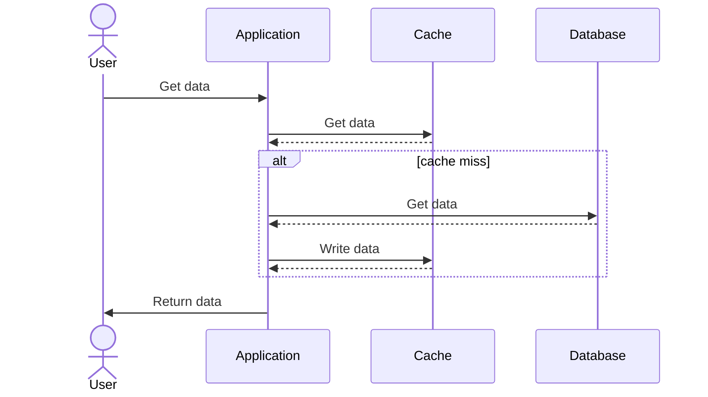

# Cache-aside pattern
This repo
* Explains the cache-aside pattern, also known as lazy loading.
* Provides an example of implementing this pattern using **Python**, **Flask**, **Redis** and **MySQL**.

## Context

Cache-aside pattern is one of the most common caching patterns. It works as following:

- **Read from cache**: the application first checks if the requested data is present in the cache.
- **Cache miss**: if the data is not found (cache miss), the application then queries the database to retrieve the data.
- **Populate cache**: once the data is fetched from the database, it is populated to the cache for future access.
- **Return data**: the data is then returned to the client.

Below is the sequence diagram illustrating the process flow:



#### Pros:
*

#### Cons:
*

#### When to choose this pattern:
*

## How to run this example:

* Clone this repository to your machine.
* Create a virtual environment `virtualenv -p python3 .venv`
* Activate the virtual environment `source .venv/bin/activate`
* Install dependencies `pip install -r requirements.txt`
* Up mysql and redis containers `docker-compose up -d`, this will create two containers `mysql-svc` and `redis-svc`
* Run the `db.sql` script to create the `grocerydb` database, the `fruit` table  and populate the table with data `docker exec -i mysql-svc mysql -u root -proot < db.sql`. Notice that there is no space between the `-p` param and the password.
* You can check the the db inside the container as following:
    * Run `docker exec -it mysql-svc sh`
    * Run `mysql -u root -proot;`
    * Run `use grocerydb;`
    * Run `show tables;`
    ```
    mysql> show tables;
    +---------------------+
    | Tables_in_grocerydb |
    +---------------------+
    | fruit               |
    +---------------------+
    1 row in set (0.00 sec)
    ```
    * Run `select * from fruit;`
    ```
    mysql> select * from fruit;
    +----+--------+----------+
    | id | name   | quantity |
    +----+--------+----------+
    |  1 | apple  |      100 |
    |  2 | orange |      200 |
    |  3 | pear   |      300 |
    +----+--------+----------+
    3 rows in set (0.01 sec)
    ```
* Run flask app `flask --debug run`, the `--debug` flag enables hot reloading.
* Make an API call `curl http://127.0.0.1:5000/fruit/1`. In this case it will be a cache miss.
```
{
  "data": {
    "id": 1,
    "name": "apple",
    "quantity": 100
  },
  "from_cache": false
}
```
* If you repeat the same API call you get the data from the cache (cache hit)
```
{
  "data": {
    "id": 1,
    "name": "apple",
    "quantity": 100
  },
  "from_cache": true
}
```
* You can check the content of the redis cache as follwoing:
    * Run `docker exec -it redis-svc sh`
    * Run `redis-cli KEYS *`, It will list all keys stored in redis
    ```
    # redis-cli KEYS *
    1) "fruit:1"
    ```
    * Run `redis-cli GET fruit:1`
    ```
    # redis-cli GET fruit:1
    "{\"id\": 1, \"name\": \"apple\", \"quantity\": 100}"
    ```
